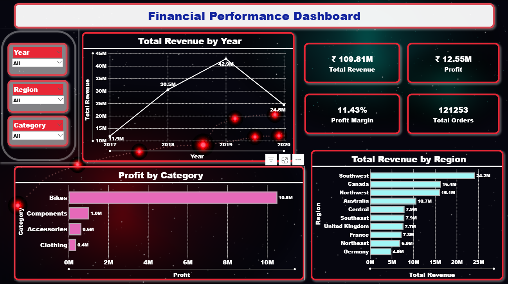

# 📊 Financial Performance Dashboard

## 📌 Project Overview

This project focuses on analyzing business performance using a **multi-page Power BI dashboard** built on the **AdventureWorks Sales dataset**. It provides insights into **revenue, profit, product performance, and regional trends** to support data-driven decision-making. Interactive visualizations were created to explore key financial metrics and uncover meaningful business insights.

---

## 🎯 Objectives

* Analyze overall financial performance (Revenue, Profit, Orders)
* Identify trends over time (Year & Month analysis)
* Evaluate product performance (Top & Loss-making products)
* Compare regional performance across different markets
* Enable interactive exploration using filters and slicers

---

## 📂 Dataset Description

The project uses the **AdventureWorks Sales dataset** (uploaded in this repository), which contains sales-related information with key attributes such as:

* Sales Amount
* Order Quantity
* Product Category & Product
* Sales Territory / Region / Country
* Order Date, Ship Date, Due Date
* Unit Price & Product Cost

---

## 📊 Key Insights

* Revenue showed significant growth until a peak year, followed by a decline
* Certain product categories contribute most to overall profit
* A few products generate high profit, while some consistently incur losses
* Regional analysis highlights top-performing and underperforming markets
* Profit margin varies significantly across product categories

---

## 📈 Dashboard Features

### 🟦 Page 1: Financial Overview

* KPI Cards (Revenue, Profit, Profit Margin, Orders)
* Revenue Trend by Year
* Profit by Category
* Revenue by Region

### 🟪 Page 2: Revenue Analysis

* Monthly Revenue Trend
* Top & Bottom Products by Revenue
* Revenue Distribution by Country

### 🟩 Page 3: Product Analysis

* Top & Loss-Making Products by Profit
* Profit Margin by Category
* Revenue vs Profit Comparison

### 🟧 Page 4: Regional Analysis

* Revenue by Region
* Profit by Region
* Revenue vs Profit Comparison
* Region-wise performance breakdown

---

## 🛠️ Tools & Technologies

* **Power BI** (Dashboard Development & Visualization)
* **DAX** (Measures & Calculations)
* **Power Query** (Data Cleaning & Transformation)
* **Excel / CSV** (Data Source)

---

## 🚀 How to Use

1. Download the `.pbix` file from this repository
2. Open it using **Power BI Desktop**
3. Use slicers (Year, Region, Category) to explore insights
4. Interact with visuals for deeper analysis

---

## 📌 Business Impact

* Helps organizations monitor financial performance effectively
* Identifies profitable and loss-making products
* Supports regional strategy and market analysis
* Enables better decision-making through interactive insights

---

## 📷 Dashboard Preview

---

## 🔮 Future Scope

* Add forecasting for revenue trends
* Integrate real-time data sources
* Implement advanced analytics using Python/R
* Enhance UI/UX for better storytelling

---

## 👩‍💻 Author

**Aditi Kodande**

📧 [aditikodande9@gmail.com](mailto:aditikodande9@gmail.com)
🔗 [https://linkedin.com/in/aditi-kodande](https://linkedin.com/in/aditi-kodande)
